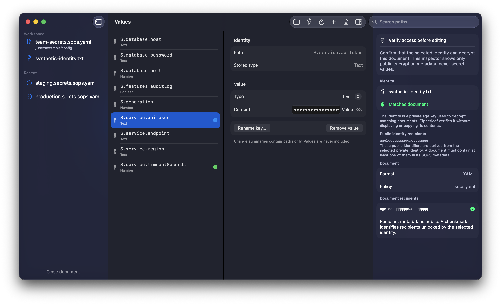

# Cipherleaf

Cipherleaf is a native macOS editor for existing
[SOPS](https://github.com/getsops/sops) documents encrypted with native
[age](https://github.com/FiloSottile/age) recipients.

It gives operators a focused GUI without turning plaintext into a working
file:

- decrypted content moves through pipes and stays in app memory;
- private age identities remain at the path selected by the user;
- secret values are concealed by default and never appear in change reviews;
- edits are applied to a same-directory ciphertext staging file with
  `sops set --value-stdin` and `sops unset`;
- the staging file is decrypted and compared with the intended document
  before an atomic replacement;
- the installed encrypted file has mode `0600`;
- the existing recipient set is checked before and after every save.

Cipherleaf supports encrypted YAML, JSON, and dotenv files. It edits scalar
values in JSON-compatible document trees: strings, numbers, Booleans, and
nulls. It does not create identities, create a new encrypted document, rotate
recipients, or replace SOPS policy management.

## Workspace



The workspace keeps the encrypted document and selected identity on the left,
scalar paths and change markers in the middle, and a concealed value editor
beside the Security Inspector. The inspector confirms the public recipient
match without displaying identity contents or secret values. The screenshot
uses synthetic names and values only.

## Download

Download the signed and notarized app from the
[latest GitHub release](https://github.com/luzanovdm/cipherleaf/releases/latest).

1. Install the required command-line tools with `brew install age sops`.
2. Download `Cipherleaf-<version>-macos.zip` and open it.
3. Move `Cipherleaf.app` to Applications and launch it normally.

The release is a universal macOS app for Apple silicon and Intel Macs. GitHub
also provides a SHA-256 checksum beside the archive.

## Requirements

- macOS 15 or newer
- SOPS and age installed locally

Install the command-line tools with Homebrew:

```sh
brew install age sops
```

## Run from source

```sh
brew install xcodegen
git clone https://github.com/luzanovdm/cipherleaf.git
cd cipherleaf
xcodegen generate
open Cipherleaf.xcodeproj
```

Run the `Cipherleaf` scheme from Xcode.

## First use

1. Choose the private native age identity file created by `age-keygen`, with
   permissions `0600`. Do not choose the SOPS document or `.sops.yaml`.
2. Open an existing SOPS-encrypted YAML, JSON, or dotenv document.
3. Check that the selected identity matches a public recipient in the
   Security inspector.
4. Add, edit, rename, or remove scalar values.
5. Save and review the redacted list of changed paths.

Cipherleaf shows the nearest `.sops.yaml` when one exists, but saving does not
require it. Existing SOPS metadata remains authoritative, and Cipherleaf
refuses a save if the recipient set changes unexpectedly.

SOPS can remove comments from YAML and dotenv documents while applying
`set`/`unset`. Cipherleaf detects comment lines in the encrypted source and
shows a warning in the save review.

Read the [user guide](docs/user-guide.md) before the first production edit and
the [security model](docs/security-model.md) before deciding whether the
application fits your threat model.

## Development

```sh
brew install actionlint age ripgrep shellcheck sops xcodegen
Scripts/test.sh
shellcheck Scripts/*.sh
actionlint .github/workflows/*.yml
```

`Scripts/test.sh` runs architecture and security guardrails, strict
`swift-format` linting, unit tests, and synthetic SOPS/age integration tests.
CI also lints shell scripts and workflows, builds an unsigned review package,
and verifies the Icon Composer resources in the app bundle.

Building from source requires Xcode 26 or newer. The generated
`Cipherleaf.xcodeproj` is intentionally ignored; `project.yml` is the source
of truth.

See [architecture](docs/architecture.md), [contributing](CONTRIBUTING.md), and
[distribution](docs/distribution.md) for more detail.

## Privacy

Cipherleaf has no analytics, network client, or account system. It never writes
secret values to the clipboard automatically and has no dedicated copy-secret
action; standard macOS editing commands remain available while a value is
explicitly revealed. Its privacy manifest declares no collected data and no
tracking.

## License

MIT
